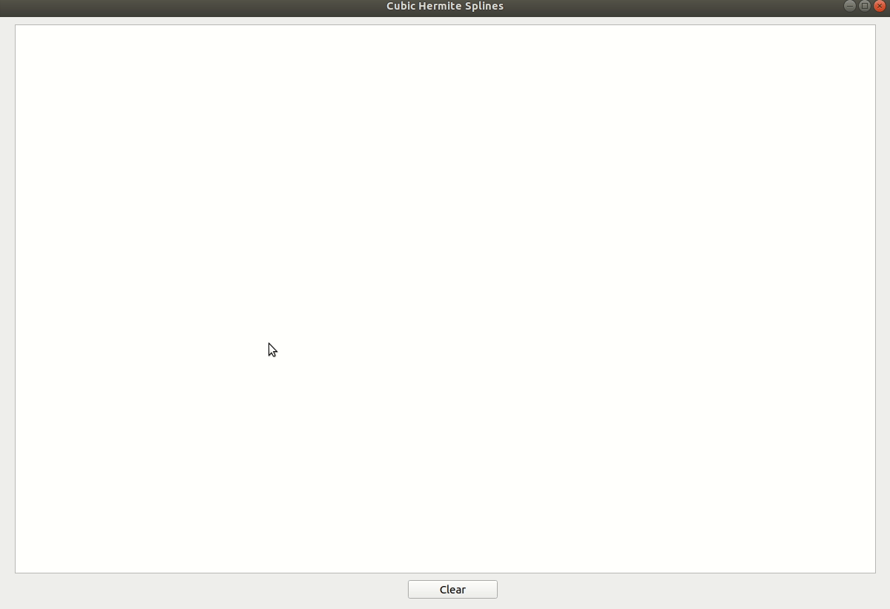

# CubicHermiteSplines

This Qt5 application allows you to draw cubic hermite splines with the help of tangent lines.

### Requirements
* [Eigen](http://eigen.tuxfamily.org/index.php?title=Main_Page) linear algebra library for C/C++
* Qt5

### Build

To build the project you must specify the Eigen library location on your system in the next line in the `CubicHermiteSplines.pro` file: `INCLUDEPATH += "your/Eigen/lib/location`
