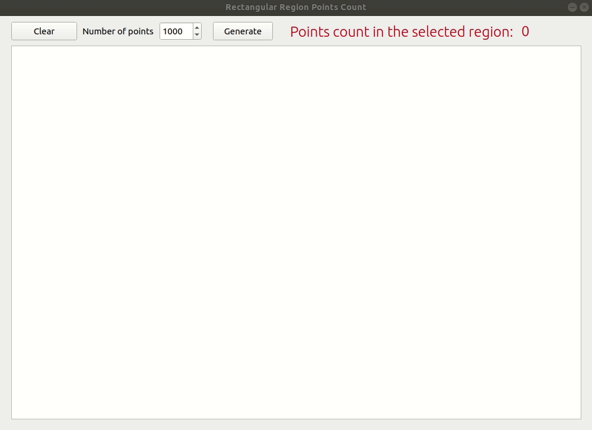

# RectangularRegionPointsCount

This Qt5 app implements simple regional count algorithm. Add or randomly
generate points on the plane and select rectangular region -> number of points
that belong to the specified region will be shown in the toolbar.

Assume there are N points created on the plane.
The algorithm consists from the two parts:
* The preprocessor. It works in O(N ^ 2) time
* The count algorithm. Each query works in O(log N) time.

After any point is changed the preprocessor must be invoked.

